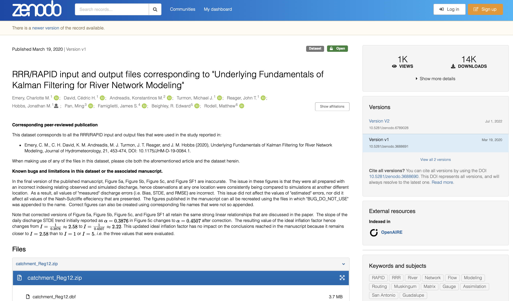
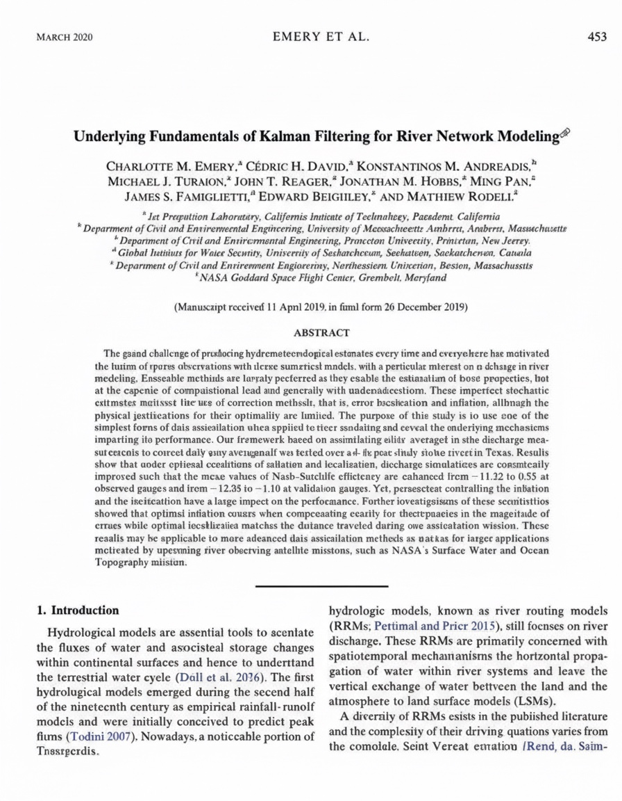

# Lección 1: Introducción al proceso de Ciencia Abierta

## Navegación

-   [Definición de Ciencia Abierta y productos de investigación](#definici%C3%B3n-de-ciencia-abierta-y-productos-de-investigaci%C3%B3n)
-   [Usar herramientas para la Ciencia Abierta en la práctica](#usar-herramientas-para-la-ciencia-abierta-en-la-pr%C3%A1ctica)
-   [Lección 1: Resumen](#lecci%C3%B3n-1-resumen)
-   [Lección 1: Evaluación](#lecci%C3%B3n-1-evaluaci%C3%B3n)

## Descripción general

En esta lección revisaremos la definición de Ciencia Abierta y algunos otros términos comunes, incluyendo productos de investigación, datos, código, software y resultados. Conocer estas definiciones ayuda a participar y contribuir al mundo de la Ciencia Abierta. Además, veremos ejemplos que muestran cómo se usan estas herramientas de Ciencia Abierta en la práctica. La lección concluye con un ejemplo de cómo un grupo compartió sus datos, resultados, software y artículos de forma abierta.

## Objetivos de aprendizaje

Al finalizar esta lección deberías ser capaz de:

- Definir los tipos comunes de productos de investigación incluyendo datos, software y resultados.
- Enumerar formas comunes de compartir datos, código y resultados al practicar la Ciencia Abierta.

## Definición de Ciencia Abierta y productos de investigación

### ¿Qué es la Ciencia Abierta?

Créditos de imagen: «Earth Science», NASA [1992].

«La Ciencia Abierta es una cultura de colaboración, posibilitada por la tecnología, que fortalece el intercambio abierto de datos, información y conocimiento dentro de la comunidad científica y también con el público en general, con el objetivo de acelerar la investigación y la comprensión científica (Ramachandran et al. 2021).»  
Ramachandran et al. 2021

---

### Productos de investigación abiertos

El conocimiento científico, o los productos de investigación, adopta la forma de datos, resultados, código y software.

Créditos de imagen: Modificado a partir de «Scientist explaining with graph», illustrAC.

Además de estos productos de investigación, se incluyen otros tipos de productos, como metodologías, algoritmos y artefactos físicos.

### ¿Qué son los datos?

En general, los datos son fragmentos de información sobre un tema, incluidas verdades teóricas, mediciones en bruto o valores altamente procesados.

Incluso puede haber datos sobre los datos, llamados metadatos. En nuestras lecciones, cuando hablamos de datos nos referimos a información científica o técnicamente relevante que puede almacenarse digitalmente y a la que se puede acceder electrónicamente, como por ejemplo:

- Información producida por misiones y experimentos, incluidas calibraciones, coeficientes y documentación
- Información necesaria para validar las conclusiones científicas de las publicaciones revisadas por pares

Los datos abiertos pueden presentar muchas características, incluidos metadatos sólidos y bien nutridos, y estar disponibles en una variedad de formatos. Estas características se detallan más adelante en este módulo y se desarrollan aún más en el módulo sobre Datos Abiertos.

### ¿Qué es el código?

Muchas personas que hacen ciencia escriben código fuente para producir software con el que analizar datos o modelar observaciones. El código es un lenguaje que los seres humanos pueden escribir y entender. El software suele ser un conjunto de programas, datos y otra información que un sistema informático usa para realizar tareas específicas. Las personas que hacen ciencia escriben y usan muchos tipos de software en el marco de sus investigaciones.

**Software de propósito general**

Software producido para un uso generalizado, no para fines científicos especializados. Esta clasificación alcanza tanto al software comercial tradicional como al de Código Abierto.

**Software operativo y de infraestructura**

Software usado por centros de datos y grandes instalaciones de tecnologías de la información para ofrecer servicios de datos.

**Librerías**

También llamadas bibliotecas. Conjuntos de código reusables ya escritos, que contienen implementaciones estandarizadas de algoritmos frecuentes y utilidades para tareas como análisis estadístico, manipulación de datos y visualización, entre otras. Estas bibliotecas están pensadas para integrarse en sistemas de software más grandes y permiten a quienes desarrollan software incorporar funcionalidades complejas sin necesidad de programarlas desde cero.

**Software de modelación y simulación**

Software que implementa soluciones a ecuaciones matemáticas a partir de datos de entrada y condiciones de contorno, o que infiere modelos a partir de datos.

**Software de análisis**

Software desarrollado para manipular mediciones o resultados de modelos con el fin de visualizarlos o comprenderlos.

**Software de un solo uso**

Software escrito para usarse en casos únicos, por ejemplo, para elaborar un gráfico para un artículo o manipular datos de una manera específica.

Algunas de las herramientas que se pueden usar para desarrollar software se presentan en la Lección 4. Entender cómo encontrar y usar código de otras personas, cómo crear código propio y cómo compartirlo son partes importantes del avance de la ciencia, tema que se desarrollará en el Módulo 4, «Código Abierto».

### ¿Qué son los resultados?

Los resultados reúnen los distintos productos de la investigación del proceso científico. Las publicaciones son el tipo de resultado más común, pero también se incluyen muchos otros tipos de productos. Tanto los datos como el software pueden considerarse resultados, pero cuando hablemos de resultados en este contexto pondremos el foco en otros tipos de productos. Los resultados pueden incluir lo siguiente:

- Publicaciones revisadas por pares
- Notebooks (cuadernos virtuales de programación)
- Entradas de blog
- Videos y pódcast
- Publicaciones en redes sociales
- Resúmenes y presentaciones en congresos
- Foros de debate

Puede que nos sea familiar el ciclo de vida de la investigación, pero aún desconocemos los tipos de resultados que pueden compartirse abiertamente a lo largo de este proceso. Al compartir resultados, es importante intentar proveer la mayor apertura posible, con el objetivo de aumentar la reproducibilidad, la disponibilidad y la transparencia de la ciencia. A lo largo del ciclo de vida de la investigación, existen múltiples oportunidades para compartir abiertamente diferentes resultados, que pueden dar lugar a nuevas colaboraciones y líneas de investigación. Se ofrecen más detalles sobre el alcance de los resultados abiertos en el Módulo 5, «Resultados Abiertos».

## Usar herramientas para la Ciencia Abierta en la práctica

En las siguientes lecciones de este módulo exploraremos diferentes herramientas y recursos a disposición de quienes investigan para usar, crear y compartir la Ciencia Abierta. Como ya se ha mencionado, es importante pensar en cómo integrar los principios de la Ciencia Abierta en todas las fases del proceso de investigación. Aquí daremos un panorama general de cómo podrían funcionar juntas las distintas piezas.

### Componentes de la Ciencia Abierta

Los cuatro componentes principales de la Ciencia Abierta pueden organizarse en una pirámide de productos de investigación compartidos abiertamente.

El artículo de investigación, estrechamente vinculado a los resultados, se sitúa en la cúspide de la pirámide y resume cómo se han combinado el software y los datos para obtenerlos.

La práctica de compartir estos componentes puede realizarse en distintos grados de exhaustividad. Para las siguientes orientaciones sobre cómo compartir componentes de Ciencia Abierta, simplificamos el rango de exhaustividad a «bueno», «mejor» y «óptimo». Esta gama refleja nuestro compromiso de compartir la ciencia en todas las etapas del proceso de investigación y en todos sus productos.

### Compartir datos abiertos

Los datos pueden compartirse fácilmente a través de muchos servicios diferentes. La mejor forma de compartirlos suele ser a través de un repositorio de datos a largo plazo que los preserve y los haga encontrables. La siguiente imagen ofrece algunas consideraciones al compartir datos a través de [Zenodo](https://zenodo.org/) (enlace externo), un repositorio de datos generalista. Estas consideraciones serían similares para otros repositorios de datos. Ver el Módulo 3 «Datos Abiertos» para obtener más detalles sobre cómo compartir datos abiertos.
Zenodo

### Compartir código abierto

Cuando se comparte Código Abierto, con frecuencia se hace a través de una plataforma en línea de control de versiones que permite a quienes tengan interés contribuir al software y proporciona un historial de cambios en el mismo. Por ejemplo, muchas veces quienes investigan optan por publicar archivos de código en [GitHub](https://github.com/) (enlace externo) bajo la licencia BSD (de 3 cláusulas). Esto permite que otras personas contribuyan y reusen el software. Los pasos para preservar el código y hacerlo accesible se abordan en el Módulo 4, «Código Abierto».

### Compartir un artículo abierto

Quienes investigan pueden optar por publicar en una revista que use una licencia de Acceso Abierto. Para ello, puede usarse el Directorio de Revistas de Acceso Abierto (DOAJ, por sus siglas en inglés) para encontrar revistas que ofrecen esta opción. Este tema se aborda con más detalle en el Módulo 5, «Resultados Abiertos».

### Compartir resultados abiertos

Cuando compartimos resultados, conviene incluir la metodología empleada para obtenerlos (es decir, la "procedencia") directamente en nuestro software. El software tiende a evolucionar con el tiempo, mientras que sus resultados pueden mantener cierta coherencia. Por lo tanto, compartir la metodología ayuda a otras personas a reproducir nuestros antiguos resultados con software más reciente, aunque los métodos para producirlos puedan variar a medida que el software evoluciona.

### Un ejemplo de proyecto de Ciencia Abierta

A continuación veremos un ejemplo de cómo un grupo de investigación compartió abiertamente sus datos, resultados y software; todo esto con sus propios identificadores únicos. Hay que tener en cuenta que los datos y el software pueden tener varios identificadores, lo que permite citarlos en todas las versiones o en una única versión.

Aquí se pueden revisar por separado los distintos elementos de la imagen anterior. Seleccionar los botones «\<» y «\>» para navegar.

**Datos**

Esta versión: [https://doi.org/10.5281/zenodo.3688691](https://doi.org/10.5281/zenodo.3688691)

Todas las versiones: [https://doi.org/10.5281/zenodo.3688690](https://doi.org/10.5281/zenodo.3688690)

**Resultados**

[https://doi.org/10.1175/JHM-D-19-0084.1](https://doi.org/10.1175/JHM-D-19-0084.1)

**Software**

Esta versión: [https://github.com/c-h-david/rapid](https://github.com/c-h-david/rapid)

Todas las versiones: [https://doi.org/10.5281/zenodo.593867](https://doi.org/10.5281/zenodo.593867)

## Lección 1: Resumen

En esta lección has aprendido:

- El conocimiento científico o los productos de la investigación adoptan la forma de: datos, software y resultados.
- En general, los datos son partes de información acerca de un tema, incluidas verdades teóricas, mediciones en bruto (información sin ningún procesamiento) o valores altamente procesados.

## Lección 1: Evaluación

Responde las siguientes preguntas para poner a prueba lo que has aprendido hasta ahora.

*Pregunta*

**01/03**

Lee esta afirmación y decide si es verdadera o falsa.

*La Ciencia Abierta es una cultura de colaboración, posibilitada por la tecnología, que fortalece el intercambio abierto de datos, información y conocimiento dentro de la comunidad científica y también con el público en general, con el objetivo de acelerar la investigación y la comprensión científica.*

- Verdadero
- Falso

*Pregunta*

**02/03**

¿Cuáles son los cuatro productos principales de la Ciencia Abierta?

Selecciona todas las que correspondan.

- Presupuestos
- Resultados
- Inclusión
- Datos
- Código
- Artículo

*Pregunta*

**03/03**

¿Cuál de los siguientes es un tipo de software? 

Selecciona todas las que correspondan.

- Propósito general
- Operacional y de Infraestructura
- Modelado y Simulación
- Análisis
- Material

### Referencias

Ramachandran, R., Bugbee, K., y Murphy, K. (2021). From Open Data To Open Science. Earth and Space Science, 8, e2020EA001562. [https://doi.org/10.1029/2020EA001562](https://doi.org/10.1029/2020EA001562) (enlace externo).
